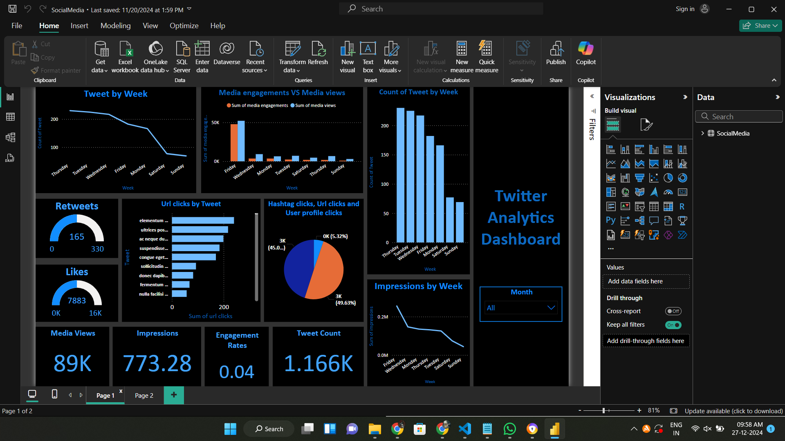
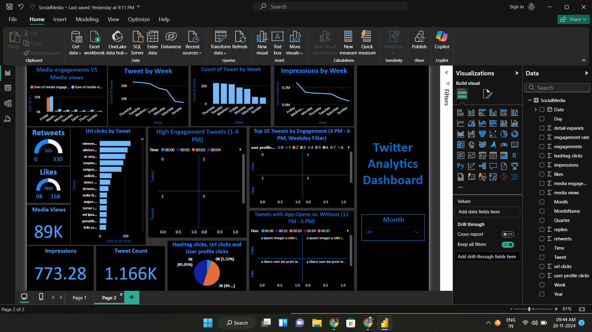

# Real-Time Twitter Analytics Dashboard - Power BI

## Introduction

This project focuses on building a **Real-Time Twitter Analytics Dashboard** using Power BI to analyze and visualize key insights from Twitter data. The project highlights tasks such as identifying top-performing tweets, calculating engagement rates, and comparing tweets with app opens versus those without.

---

## Project Tasks

### 1. Top Engagement Rate Chart
- **Description:** Displays tweets in the top 10% of engagement rates, meeting criteria like over 50 likes, weekdays only, specific times (1 PM–4 PM), and word count under 30.

### 2. Top 10 Tweets by Retweets & Likes
- **Description:** Lists top 10 tweets by the sum of retweets and likes, filtered for weekdays, odd-numbered dates, and word count below 30.

### 3. Engagement Rate Comparison
- **Description:** Compares tweets with and without app opens based on engagement rate, filtered for weekdays, impressions, and tweet length constraints.

---

## Challenges Faced

- **Dataset Cleaning:** Addressing inconsistencies in date and time formats.
- **Filter Optimization:** Ensuring multiple filter conditions are applied dynamically in Power BI.
- **Time Constraints:** Adapting visualizations to specific time ranges.

---

## Outcomes

- A dynamic, real-time analytics dashboard providing actionable insights on tweet performance.
- Enhanced understanding of Power BI's capabilities and Python integration for custom visualizations.

---

### Screenshot 1

### Screenshot 2

